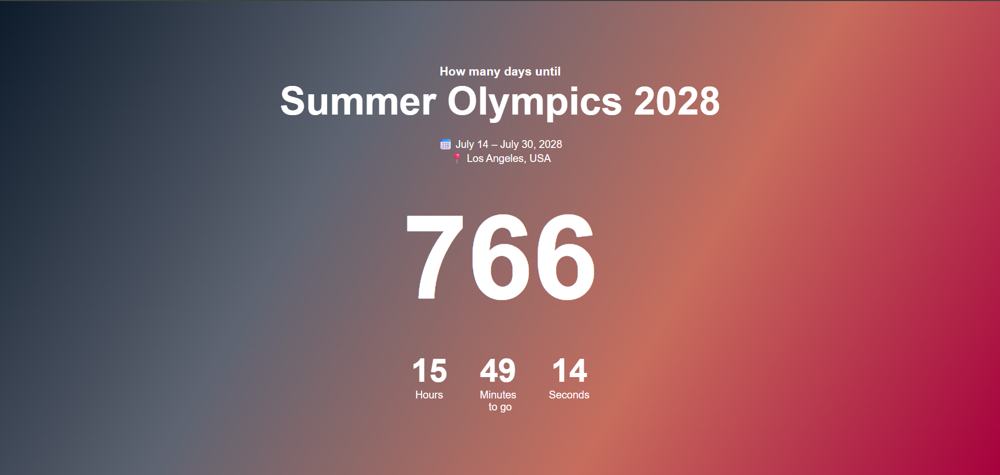

# 🏅 Olympics Countdown Timer

A simple countdown timer built using HTML, CSS, and JavaScript.

## 🚀 Features

- Live countdown timer
- Displays Days, Hours, Minutes, and Seconds
- Updates every second
- Responsive design
- Beautiful gradient background

## 🛠 Technologies Used

- HTML5
- CSS3
- JavaScript

## 📂 Project Structure

```text
index.html
style.css
script.js
README.md
screenshot.png
```
## Preview



https://abhishek-jha229.github.io/Summer-Olympics-2028-Countdown/

## ▶️ How to Run

1. Download the project.
2. Open `index.html` in your browser.
3. Enjoy the countdown timer.

## 👨‍💻 Author

Abhishek jha
